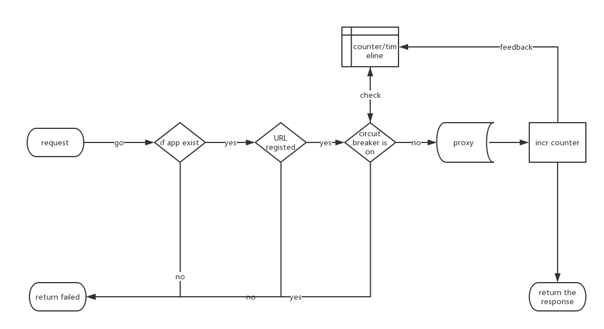

# Guard

[](https://travis-ci.org/jiajunhuang/guard)
[](https://codecov.io/gh/jiajunhuang/guard)


guard is a generic high performance circuit breaker & proxy written in Go. It has four major components:

- radix tree & response status ring: which stores registered URLs
- load balancer: which distributes requests(algorithms: randomized distribute, round robin, weighted round robin)
- circuit breaker: which makes sure your backend services will not be broken down by a large quantity of requests
- proxy server: it's based on fasthttp

## Workflow



## Benchmark

I've made a simple benchmark on my laptop(i5-3210M CPU @ 2.50GHz with 4 cores):

```bash
$ wrk --latency -H "Host: www.example.com" -c 2048 -d 30 -t 2 http://127.0.0.1:9999  # Nginx with 4 workers
Running 30s test @ http://127.0.0.1:9999
  2 threads and 2048 connections
  Thread Stats   Avg      Stdev     Max   +/- Stdev
    Latency    99.62ms  158.44ms   1.36s    95.41%       
    Req/Sec     6.43k     2.43k   11.36k    53.85%
  Latency Distribution   
     50%   58.34ms                                       
     75%  153.81ms                                                         
     90%  165.62ms                                                                               
     99%  965.10ms                       
  383670 requests in 30.09s, 311.00MB read
  Socket errors: connect 1029, read 0, write 0, timeout 114
Requests/sec:  12749.73                           
Transfer/sec:     10.33MB                         

$ wrk --latency -H "Host: www.example.com" -c 2048 -d 30 -t 2 http://127.0.0.1:23456  # guard with GOMAXPROCS=4
Running 30s test @ http://127.0.0.1:23456
  2 threads and 2048 connections
  Thread Stats   Avg      Stdev     Max   +/- Stdev
    Latency    45.78ms   34.36ms   1.12s    89.09%
    Req/Sec    11.35k     1.18k   14.19k    73.20%
  Latency Distribution                                   
     50%   41.87ms     
     75%   56.55ms       
     90%   74.52ms                                       
     99%  111.06ms                                                         
  676392 requests in 30.07s, 532.82MB read
  Socket errors: connect 1029, read 0, write 0, timeout 0
Requests/sec:  22494.06
Transfer/sec:     17.72MB
```

For now, guard's proxy performance is about ~~55% of Nginx~~ **1.76x** faster than Nginx,
and **I'm still working on it! Don't worry, it will become better and better!**

By the way, ~~thanks the [suggestion](https://github.com/jiajunhuang/guard/issues/15) 
from [@dongzerun](https://github.com/dongzerun), by configure the `GOGC` in environment,
guard's proxy performance is about 70% of Nginx.~~ guard does not allocate much memory now,
`GOGC` does not make a change, but still say thanks to [@dongzerun](https://github.com/dongzerun)!

## TODO

- [x] radix tree(thanks @[httprouter](https://github.com/julienschmidt/httprouter))
- [x] timeline buckets for statistics
- [x] load balancer algorithm with weighted round robin
- [x] load balancer algorithm with round robin
- [x] load balancer algorithm with random
- [x] circuit breaker
- [x] proxy server(thanks @[fasthttp](https://github.com/valyala/fasthttp))
- [x] dynamic configuration load & save
- [ ] graceful restart
- [x] ~~URL-level mutex(remove the bucket-level mutex to gain a better performance)~~ the statistics module is lock-free now
- [ ] fallback option while circuit breaker works(maybe serve a static html page, or return some words.)
- [ ] more test cases & benchmarks

## Set it up

1. build it using `go get -u`:

```bash
$ go get -u github.com/jiajunhuang/guard
```

2. start it

```bash
$ guard
```

3. now you need to register an application by send a POST request to `http://127.0.0.1:12345/app` with json like this:

```json
{
    "name": "www.example.com",
    "backends": ["127.0.0.1:80", "127.0.0.1:80", "127.0.0.1:80"],
    "weights": [5, 1, 1],
    "ratio": 0.3,
    "paths": ["/"],
    "methods": ["GET"],
    "fallback_type": "text",
    "fallback_content": "hello world"
}
```

I'm doing it like this:

```bash
$ http POST :12345/app < backends.json 
HTTP/1.1 200 OK
Content-Length: 8
Content-Type: text/plain; charset=utf-8
Date: Sun, 21 Jan 2018 08:51:16 GMT

success!
```

4. and now, it works! whoops! try it:

```bash
$ http :23456 'Host: www.example.com'
HTTP/1.1 200 OK
...
```

5. by the way, you can inspect your configuration by visit http://127.0.0.1:12345/ :

```bash
http :12345
HTTP/1.1 200 OK
Content-Length: 235
Content-Type: application/json
Date: Fri, 26 Jan 2018 14:11:02 GMT

{
    "apps": {
        "www.example.com": {
            "backends": [
                "127.0.0.1:80",
                "127.0.0.1:80",
                "127.0.0.1:80"
            ],
            "disable_tsr": false,
            "load_balance_method": "rr",
            "methods": [
                "GET",
                "GET"
            ],
            "name": "www.example.com",
            "paths": [
                "/",
                "/doc"
            ],
            "ratio": 0.3,
            "weights": [
                5,
                1,
                1
            ]
        }
    }
}
```

## Changelogs

- 2018-01-25: rewrite proxy from `net/http` to `fasthttp`, it's super fast now!
- 2018-01-24: rewrite radix tree & statistics module, it's lock-free now!
- 2018-01-22: add randomized distribute, naive round robin algorithms
- 2018-01-21: rewrite status statistics module
- 2018-01-20: guard works!
- 2018-01-19: first commit

## Thanks

- [Golang](https://golang.org)
- [fasthttp](https://github.com/valyala/fasthttp)
- [httprouter](https://github.com/jiajunhuang/httprouter)
